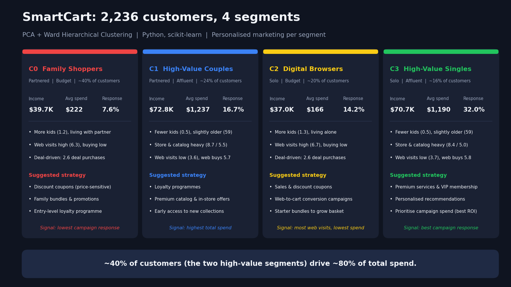
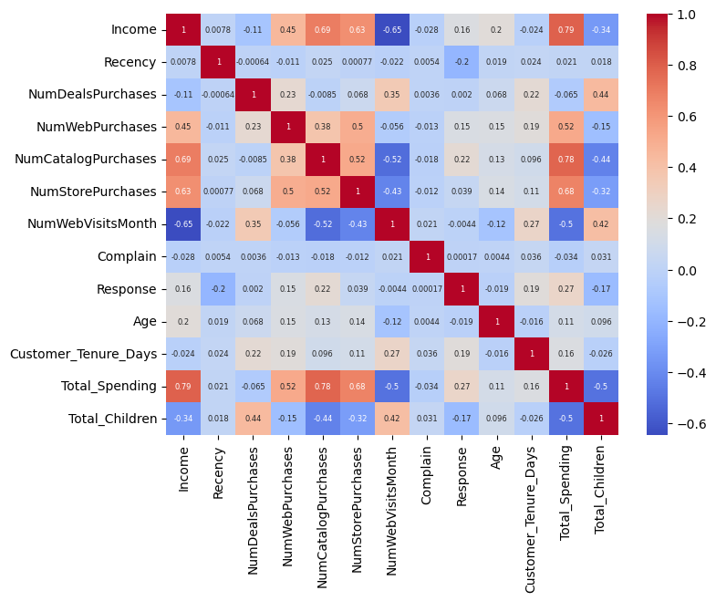
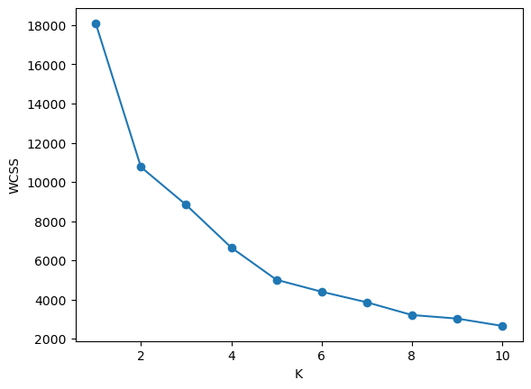
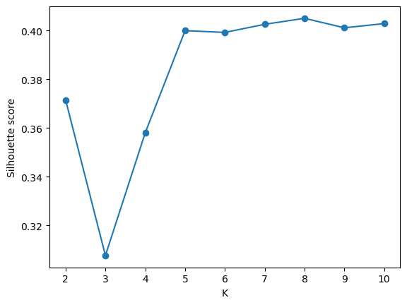
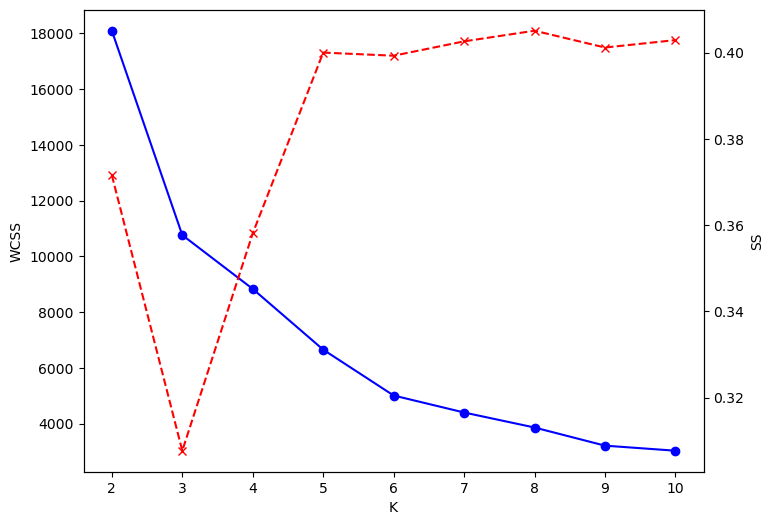
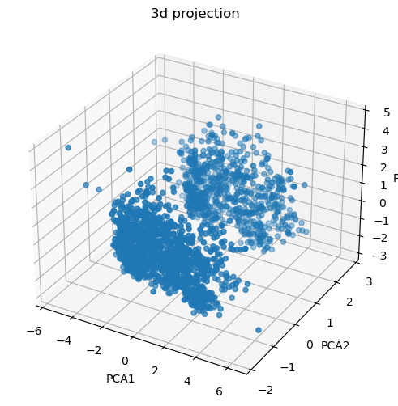
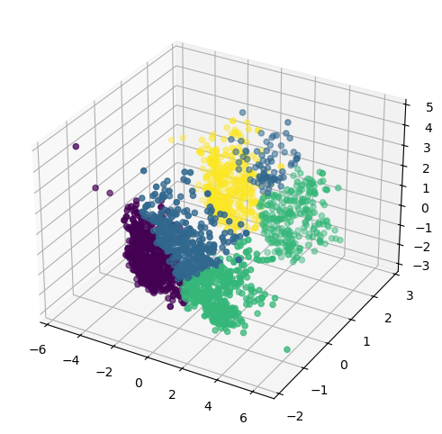
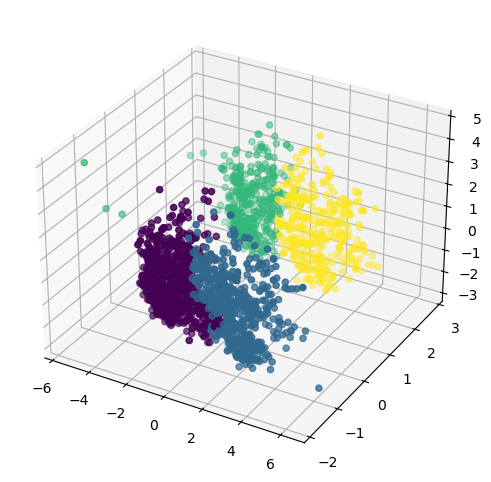
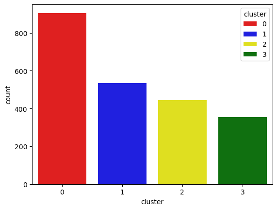
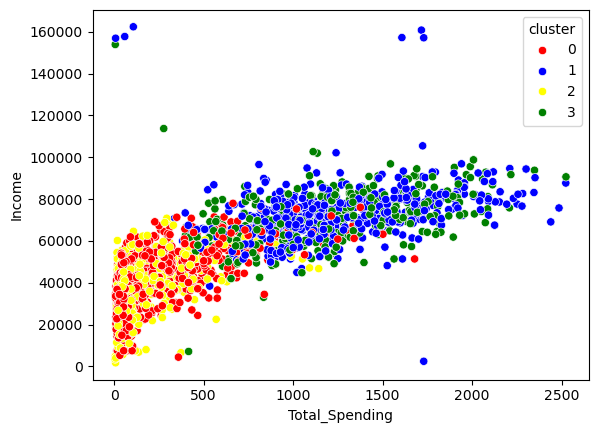

# 🛒 SmartCart: Customer Segmentation with Unsupervised Machine Learning

> Turning 2,240 raw customer records into **4 actionable customer segments** using feature engineering, PCA, K-Means and Ward Hierarchical Clustering, so marketing teams can stop guessing and start personalizing.




---

## 📌 Table of Contents

- [Problem Statement](#-problem-statement)
- [Key Results](#-key-results)
- [Customer Segments](#-customer-segments)
- [Business Recommendations](#-business-recommendations)
- [Dataset](#-dataset)
- [Methodology](#-methodology)
- [Tech Stack](#-tech-stack)
- [Visual Walkthrough](#-visual-walkthrough)
- [Project Structure](#-project-structure)
- [Getting Started](#-getting-started)
- [Limitations & Future Work](#-limitations--future-work)
- [Author](#-author)

---

## 🎯 Problem Statement

SmartCart is a growing e-commerce platform serving customers across multiple countries. It currently runs **generic marketing and engagement campaigns for every customer**, which leads to:

- Inefficient marketing spend
- Missed opportunities to retain high-value customers
- Slow identification of customers who are disengaging

**Goal:** Build an unsupervised segmentation system that groups customers by **purchasing behaviour, engagement level and household profile**, and translate those groups into decisions a marketing team can act on.

---

## 🏆 Key Results

| Metric | Value |
|---|---|
| Customers analysed | **2,240** (2,236 after outlier removal) |
| Raw features | 22 |
| Engineered features | 5 (Age, Tenure, Total Spending, Total Children, Living With) |
| Final model input | 18 features, compressed to 3 principal components |
| Optimal K (Elbow / KneeLocator) | **4** |
| Algorithms compared | K-Means, Agglomerative (Ward linkage) |
| Segments discovered | **4** |
| Spend gap between segments | High-value customers spend **5 to 7x more** than low-value ones |
| Response-rate gap | Most responsive segment converts at **32%** vs **7.6%** for the least responsive (over 4x) |
| Revenue concentration (approx.) | The two high-value segments are ~40% of customers but ~80% of total spend |

> Segment sizes are read from the cluster count plot in the notebook, so the shares above are approximate.

---

## 👥 Customer Segments

Clusters differ along two axes: **income and spending level** (high-value vs budget) and **household type** (living with a partner vs alone). Persona names are interpretive labels based on each cluster's average behaviour.

| Persona | Cluster | Household | Income | Avg. Spend | Avg. Children | Campaign Response | Web Visits / Month | Key Behaviour |
|---|---|---|---|---|---|---|---|---|
| **Family Shoppers** | C0 | Partnered | $39.7K | $222 | 1.2 | 7.6% (lowest) | 6.3 | Largest group. More children, deal-driven (2.6 deal purchases), high web visits but low purchases across web, catalog and store |
| **High-Value Couples** | C1 | Partnered | $72.8K | **$1,237** | 0.5 | 16.7% | 3.6 | Highest spend. Fewer children, slightly older (about 59), store (8.7) and catalog (5.5) heavy, average response |
| **Digital Browsers** | C2 | Alone | $37.0K | $166 | 1.3 | 14.2% | **6.7** | More children, most web visits but lowest spend, deal-driven (2.6 deal purchases) |
| **High-Value Singles** | C3 | Alone | $70.7K | $1,190 | 0.5 | **32.0%** (best) | 3.7 | Fewer children, slightly older (about 59), store (8.4) and catalog (5.0) heavy, best response to campaigns |

**Other patterns in the data**

- Recency is almost identical across all four clusters (about 48 to 50 days), so segments are driven by income, spending and household structure rather than how recently a customer purchased.
- Low-income clusters visit the website **nearly 2x more** than high-income clusters (about 6.5 vs 3.6 visits/month) yet spend far less, which points to browsing without converting.
- High-value clusters visit the site less but still buy more on the web (5.7 to 5.8 web purchases vs 2.7 to 3.2 for budget clusters).
- Low-income clusters rely more on discount purchases (2.6 vs about 1.9 deal purchases).
- Income and total spending are strongly correlated (r = 0.79), and among purchase channels, catalog purchases have the strongest link to spend (r = 0.78).

> **Note on interpretation:** the dataset has no measure of order value, product type preference, sustainability, or repeat-purchase history, so no segment is described using attributes that were not measured. "Best ROI" for High-Value Singles refers to their campaign response rate, used as a proxy.

---

## 💡 Business Recommendations

| Persona | Suggested Strategy |
|---|---|
| **Family Shoppers** (C0) | Discount coupons for a price-sensitive group, family bundles and promotions, an entry-level loyalty programme |
| **High-Value Couples** (C1) | Loyalty programmes, premium catalog and in-store offers, early access to new collections |
| **Digital Browsers** (C2) | Sales and discount coupons, web-to-cart conversion campaigns, starter bundles to grow basket size |
| **High-Value Singles** (C3) | Premium services and VIP membership, personalised recommendations, and priority campaign spend since they respond at over 4x the rate of the lowest segment |

**Impact chain:** segmented insights → targeted marketing → higher customer satisfaction → increased sales.

---

## 📂 Dataset

- **Records:** 2,240 customers
- **Attributes:** 22 across four groups

| Group | Features |
|---|---|
| Demographics | `ID`, `Year_Birth`, `Education`, `Marital_Status`, `Income`, `Kidhome`, `Teenhome`, `Dt_Customer` |
| Spending (amount) | `MntWines`, `MntFruits`, `MntMeatProducts`, `MntFishProducts`, `MntSweetProducts`, `MntGoldProds` |
| Purchase behaviour (frequency) | `NumDealsPurchases`, `NumWebPurchases`, `NumCatalogPurchases`, `NumStorePurchases`, `NumWebVisitsMonth` |
| Feedback and recency | `Recency`, `Complain`, `Response` |

> **Note:** the dataset is not bundled in this repo. Place `smartcart_customers.csv` in the project root before running the notebook. *(Add your data source or licence note here.)*

---

## 🔬 Methodology

```
Raw Data → Cleaning → Feature Engineering → Outlier Removal → Encoding → Scaling
        → PCA (3D) → Choose K (Elbow + Silhouette) → Clustering → Profiling & Insights
```

### 1. Data Cleaning
- Found **24 missing values in `Income`** and imputed them with the **median**, which is robust to income skew.

### 2. Feature Engineering
| New feature | How it was built |
|---|---|
| `Age` | Reference year minus `Year_Birth` |
| `Customer_Tenure_Days` | Days between each enrolment date and the most recent enrolment date in the data |
| `Total_Spending` | Sum of all six `Mnt*` product categories |
| `Total_Children` | `Kidhome` + `Teenhome` |
| `Education` (grouped) | Basic and 2n Cycle → *Undergraduate*; Graduation → *Graduate*; Master and PhD → *Postgraduate* |
| `Living_With` | Married and Together → *Partner*; Single, Divorced, Widow and noisy labels (`Absurd`, `YOLO`) → *Alone* |

Redundant and identifier columns (`ID`, `Year_Birth`, `Marital_Status`, `Kidhome`, `Teenhome`, `Dt_Customer` and the six `Mnt*` columns) were dropped after feature creation, taking the table from 27 columns down to 15.

### 3. Outlier Handling
- Explored with a pair plot, then removed implausible records (`Age >= 90` and `Income >= 600,000`), leaving **2,236 rows**.
- Checked feature relationships with a correlation heatmap.

### 4. Encoding and Scaling
- `OneHotEncoder` on `Education` and `Living_With` (15 → **18 features**).
- `StandardScaler` so distance-based algorithms are not dominated by large-magnitude features such as `Income`.

### 5. Dimensionality Reduction (PCA)
- Reduced 18 features to **3 principal components** (about 45% of variance retained) for clustering and 3D visualisation.

### 6. Choosing K
| Method | Result |
|---|---|
| Elbow method (WCSS) with `kneed` `KneeLocator` | **K = 4** |
| Silhouette score (K = 2 to 10) | About 0.36 at K = 4, plateauing around 0.40 for K >= 5 |

K = 4 was selected as the point of diminishing returns on WCSS that still gives a small, interpretable set of segments a marketing team can act on.

### 7. Clustering
- **K-Means** (`k=4`, `random_state=42`) as the baseline.
- **Agglomerative Clustering** (`k=4`, Ward linkage), used for the final cluster profiling.

### 8. Cluster Profiling
- Assigned labels back to the customer table, then compared segments using cluster-wise means, a cluster size plot and an Income vs Total Spending scatter plot.

---

## 🧰 Tech Stack

| Category | Tools |
|---|---|
| Language | Python 3.13 |
| Data manipulation | pandas |
| Visualisation | Matplotlib (incl. 3D scatter), Seaborn (pair plot, heatmap, count plot, scatter plot) |
| Preprocessing | scikit-learn `OneHotEncoder`, `StandardScaler` |
| Dimensionality reduction | scikit-learn `PCA` |
| Clustering | scikit-learn `KMeans`, `AgglomerativeClustering` (Ward) |
| Model selection | Elbow method, `kneed` `KneeLocator`, scikit-learn `silhouette_score` |
| Environment | Jupyter Notebook, Conda |

---

## 🖼 Visual Walkthrough

### Feature Relationships


### Choosing the Number of Clusters
| Elbow Method | Silhouette Score |
|---|---|
|  |  |



### PCA Projection and Final Clusters
| PCA (3D) | K-Means (3D) | Agglomerative / Ward (3D) |
|---|---|---|
|  |  |  |

### Segment Profiling
| Cluster Sizes | Income vs Total Spending |
|---|---|
|  |  |

---


## 🚀 Getting Started

```bash
# 1. Clone the repository
git clone https://github.com/Devanshujain336/smartcart-customer-segmentation.git
cd smartcart-customer-segmentation

# 2. (Optional) create a virtual environment
python -m venv .venv
source .venv/bin/activate        # Windows: .venv\Scripts\activate

# 3. Install dependencies
pip install -r requirements.txt

# 4. Add the dataset as smartcart_customers.csv in the project root

# 5. Launch the notebook
jupyter notebook smartcart.ipynb
```

---

## 🔭 Limitations & Future Work

Being upfront about what this project does and does not do:

- **Silhouette score is moderate (about 0.36 at K=4).** Clusters overlap, especially between the two low-income groups. Trying Gaussian Mixture Models or DBSCAN and reporting silhouette / Davies-Bouldin for the final model would tighten this up.
- **`Response` (past campaign outcome) is used as a clustering feature.** For a pure behavioural segmentation it may be cleaner to cluster on behaviour and profile `Response` afterwards, so it is measured as an outcome rather than an input.
- **K-Means vs Agglomerative is a visual comparison.** A quantitative side-by-side (silhouette, cluster stability across seeds) would make the final choice more rigorous.
- **Segments are not yet labelled by churn risk.** Recency is similar across clusters, so a dedicated churn or RFM model would be a natural next step for the retention goal.

**Roadmap**
- [ ] Add RFM features and compare against the current segmentation
- [ ] Quantitative model comparison (Silhouette, Davies-Bouldin, Calinski-Harabasz)
- [ ] Cluster stability analysis across random seeds
- [ ] Streamlit app: enter a customer profile and get their predicted segment
- [ ] Package preprocessing and clustering into a reusable scikit-learn `Pipeline`

---

## 👤 Author

**Devanshu Jain**: CS  @ NIT Kurukshetra

[Portfolio](https://www.devanshujain.xyz) · [LinkedIn](https://www.linkedin.com/in/devanshujain12/) · [GitHub](https://github.com/Devanshujain336) · [Kaggle](https://www.kaggle.com/devanshujainnnnnn) · [X / Twitter](https://x.com/Jain_Devanshu_)

If you found this useful, consider giving the repo a ⭐
